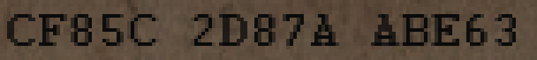

# The contested character

**One character on the paper is disputed.** The republished 2017 map guide at
https://www.scribd.com/document/351529746/Revelations-Guide reads line 6 as
`CF85C 3D87A ABE63`. I read it as `CF85C 2D87A ABE63`, and left the
transcription unchanged.

Here is that stretch of line 6, cropped from the game's own texture at its
native resolution and enlarged six times with no smoothing, so every pixel is
the original:

The disputed glyph is the first character of the middle group. It has a flat
base and a single diagonal stroke, which is how every other `2` on the paper is
drawn. A `3` has two lobes and no flat base, and you can compare one directly:
the `3` at the end of `ABE63` sits in the same crop.

Two separate passes over the texture read it as `2`, at the image's original
1024 × 512 resolution, before the key was known.

**Why it matters.** The difference sits at zero-based hex offset 362, byte 181.
If the guide were right, a `2` → `3` substitution there would cause local damage
under the CFB8, ECB and CBC modes tested, after a correct permutation. It would
not quietly hide every readable region elsewhere. A whole-message cipher such as
XXTEA could behave differently, but nothing in the image supports replacing the
`2`.

The crop is an excerpt of a *Call of Duty: Black Ops III* texture, owned by
Activision, reproduced here as evidence for this specific reading.

Unchanged compact ciphertext SHA-256:
`5c50001013a2dd862e13c38d314a0ba6d7303794287a05cc999018cf82cf4b1c`
